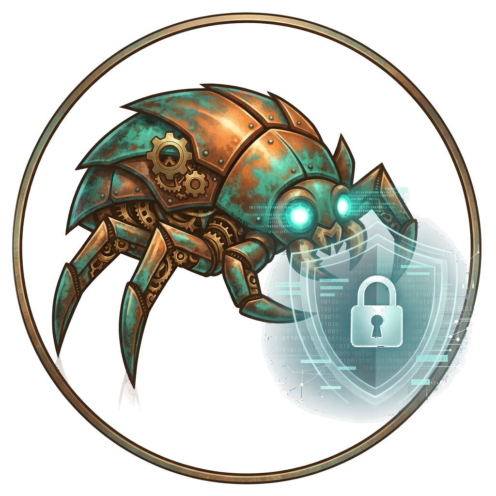

# RustMite



**Agentless Linux intrusion detection** — scan hosts over SSH, no agent to install.

A scanner node pushes a short-lived, statically linked probe into memory, streams structured evidence back, then leaves. Pure Rust end to end.

> **Prime directive:** RustMite does not decide whether a host is “truthful.”
> It checks whether the host’s story is **internally consistent** across independent kernel views.

---

## Why

Many Linux systems cannot run an EDR agent (appliances, legacy kernels, change-controlled fleets). Attackers hide from the host’s own tools (`ps`, `ls`, libc hooks, LKMs). RustMite reaches those hosts over SSH and compares the same fact from more than one interface — disagreement is the signal.


| You get                             | You don’t get                                    |
| ----------------------------------- | ------------------------------------------------ |
| Zero persistent install on targets  | Real-time kernel telemetry (that needs an agent) |
| Differential / decloak-style checks | Antivirus signature scanning                     |
| Findings with forensic evidence     | CVE / vulnerability scoring                      |
| Operator console + hunt (RPL)       | Windows / macOS coverage                         |


---


## Quick start (local console)

```bash
./dev.sh start
```

Open **[https://127.0.0.1:18080/](https://127.0.0.1:18080/)** and sign in with `admin` **/** `admin`.


| Next step                    | Where               |
| ---------------------------- | ------------------- |
| Change password / enable MFA | Settings → Account  |
| Add hosts & run scans        | Hosts → Manual scan |
| Stop the stack               | `./dev.sh stop`     |
| Options                      | `./dev.sh help`     |


Auth is **on by default**. Disable only for local tinkering: `RUSTMITE_REQUIRE_AUTH=0`. Details: `[docs/16-operator-console.md](docs/16-operator-console.md)`.

---


## Docker

**Run a packaged image**

```bash
gunzip -c rustmite-0.1.0.tar.gz | docker load
# or: docker pull your-registry/rustmite:0.1.0

docker run --rm -p 8080:8080 -p 8443:8443 \
  -v rustmite-data:/opt/rustmite/data \
  rustmite:0.1.0
# → http://127.0.0.1:8080/  (admin / admin)
```

**Build an image to share**

```bash
./scripts/share-image.sh
# → dist/rustmite-<version>.tar.gz
```

More: `[docker/share/README.md](docker/share/README.md)`.

---


## Develop & test

```bash
# Unit + fixture tests (core crates)
cargo test -p rustmite-proto -p rustmite-analyze -p rustmite-collect \
  -p rustmite-expr -p rustmite-checks

# Run seed checks against a fixture
cargo run -p rustmite-cli -- scan-fixture --fixture fixtures/diamorphine-hidden-pid

# Build musl probes (x86_64 / i686 / aarch64 / armv7)
cargo xtask build-probes --all

# SSH transport matrix (Docker)
cargo xtask ssh-matrix up && cargo xtask ssh-matrix test

# Control-plane e2e
cargo xtask e2e-stack
```

---


## Architecture (short)

```
Operator console / API          Scanner node                 Target host
 rustmite-server  ◄── TLS ──►  rustmite-node  ◄── SSH ──►  (untrusted)
                                      │
                                      └── memfd probe → JSON evidence → gone
```

Targets are always treated as adversarial. Authenticity comes from the SSH channel and the node’s signature — not from a key baked into the probe.

Full design: `[docs/](docs/)` · walkthrough: `[docs/15-how-it-works.md](docs/15-how-it-works.md)` · overview: `[docs/00-overview.md](docs/00-overview.md)`.

---


## Workspace


| Area          | Crates                                                                                                        |
| ------------- | ------------------------------------------------------------------------------------------------------------- |
| Probe path    | `rustmite-sys`, `rustmite-proto`, `rustmite-analyze`, `rustmite-collect`, `rustmite-probe`, `rustmite-loader` |
| Checks & hunt | `rustmite-expr`, `rustmite-checks`, `rustmite-rpl`                                                            |
| Delivery      | `rustmite-transport`, `rustmite-crypto`                                                                       |
| Control plane | `rustmite-server`, `rustmite-node`, `rustmite-store`, `rustmite-notify`, `rustmite-cli`                       |


---


## Docs map


| Doc                                                  | Topic                           |
| ---------------------------------------------------- | ------------------------------- |
| `[00-overview](docs/00-overview.md)`                 | Goals, constraints, trust model |
| `[08-api](docs/08-api.md)`                           | REST API & auth                 |
| `[15-how-it-works](docs/15-how-it-works.md)`         | Visual walkthrough              |
| `[16-operator-console](docs/16-operator-console.md)` | Console, login, MFA             |
| `[18-all-detections](docs/18-all-detections.md)`     | Detection catalog               |


