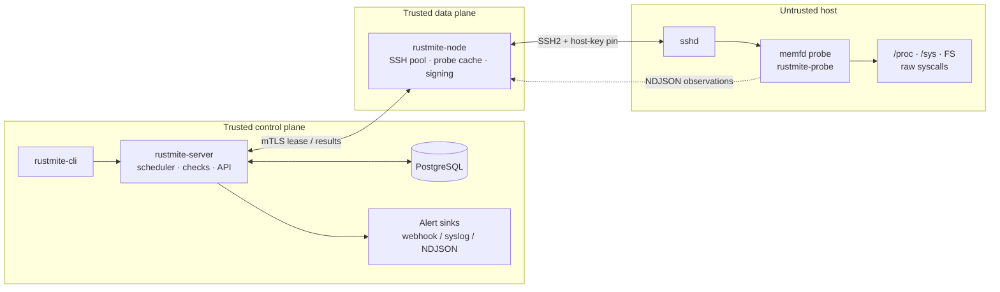
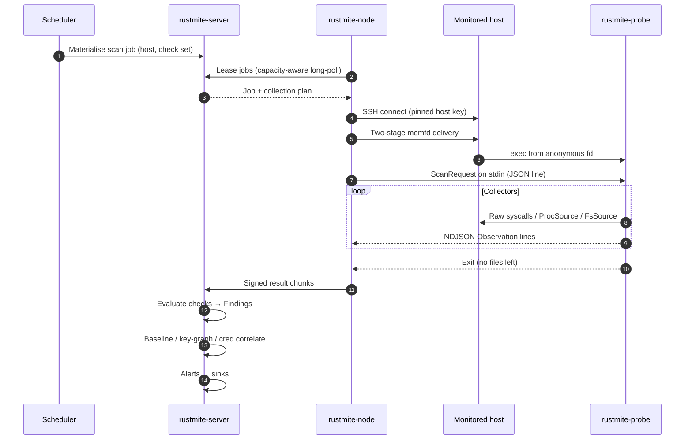
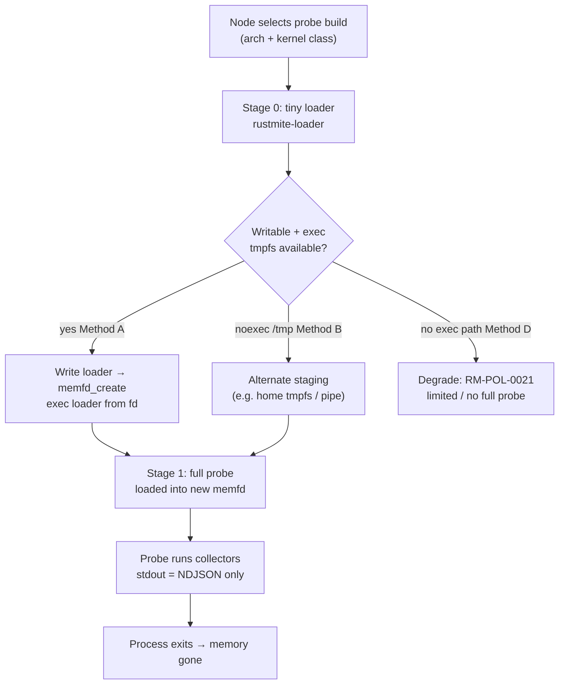
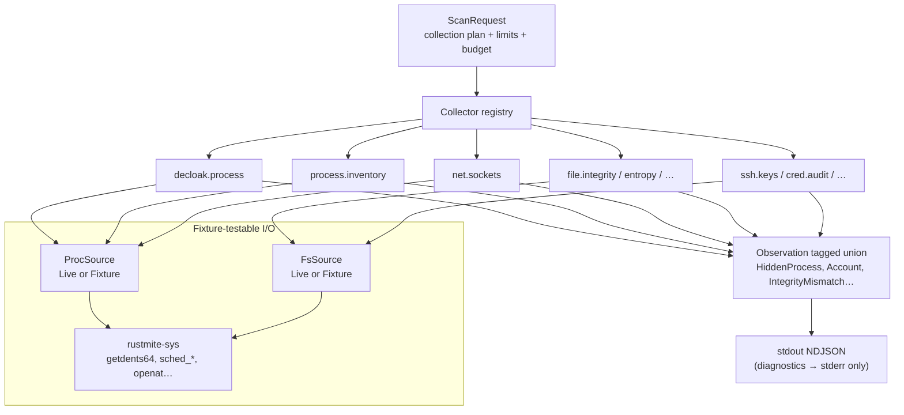
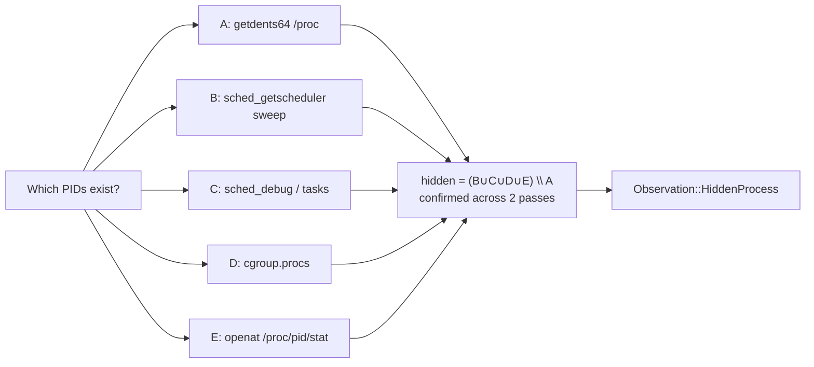
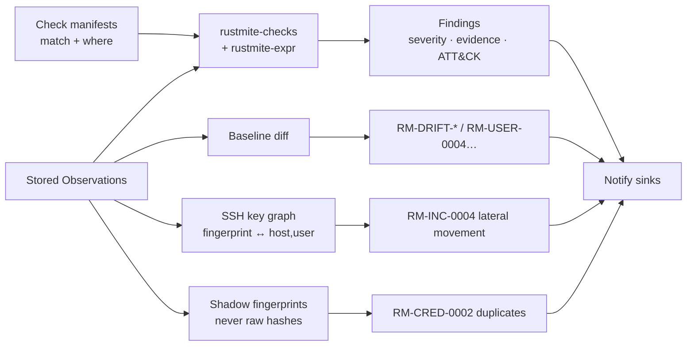
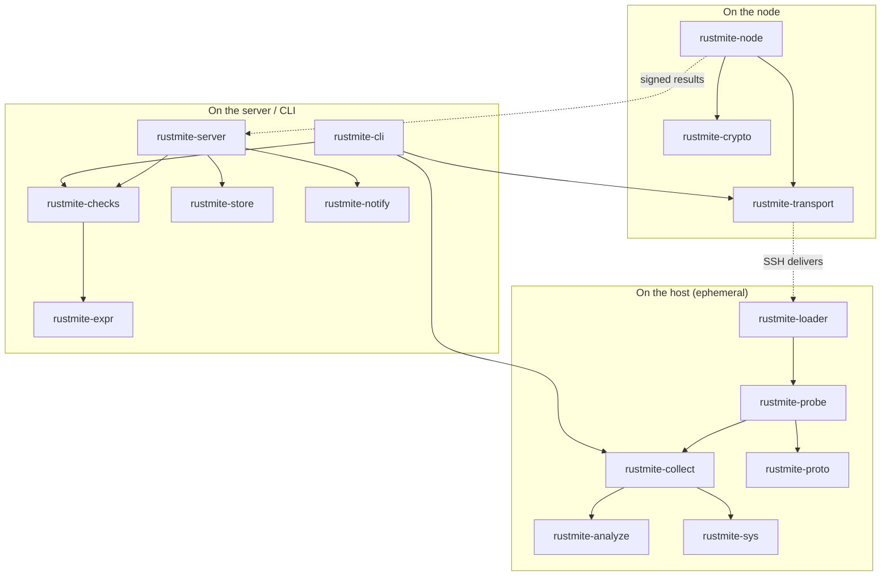
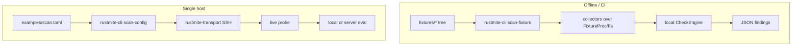
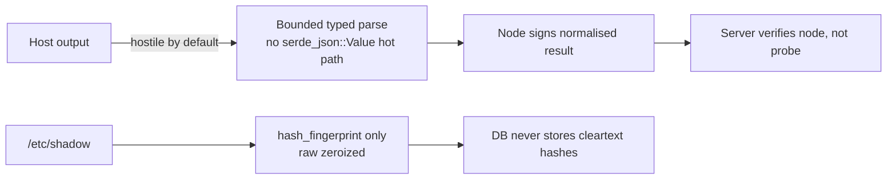

# 15 — How RustMite Works (Technical Overview)

This document is a visual walkthrough of the running system. For deep specs see
[`01-architecture.md`](01-architecture.md), [`03-probe-runtime.md`](03-probe-runtime.md),
[`04-ssh-transport.md`](04-ssh-transport.md), and [`05-check-engine.md`](05-check-engine.md).

---

## 1. One-sentence model

**Nothing stays on the host.** A trusted node opens SSH, drops a signed static probe into
anonymous memory, the probe streams raw facts (`Observation`s) back, the server turns those
facts into verdicts (`Finding`s), then the probe exits and leaves no filesystem footprint.

---

## 2. Big picture



| Layer | Trust | Job |
|---|---|---|
| Server + DB | Trusted | Schedule, evaluate checks, store, alert |
| Node | Trusted | Reach hosts, deliver probe, normalise + sign results |
| Host | **Untrusted** | May lie, kill the probe, or return hostile data |

---

## 3. End-to-end scan lifecycle



Streaming is mandatory: observations are never buffered as a full host dump on the node.

---

## 4. Probe delivery (why memfd)

The probe must not land on a writable, executable disk path the attacker can inspect or
tamper with. Delivery prefers anonymous memory:



Host-key change at connect time aborts the scan and raises **RM-POL-0001** — never auto-trust.

---

## 5. Inside the probe: collectors → observations



**Prime directive in practice:** hiding checks ask the same question through several kernel
interfaces and report *disagreement*.



---

## 6. Server-side: observations → findings

Checks are **data** (`checks/RM-*.toml`). Adding a check does not rebuild the probe.



| Concept | Meaning |
|---|---|
| **Observation** | Raw fact from a collector (not a verdict) |
| **Check** | Rule: `match` stream + `where` expression |
| **Finding** | A check that fired, with evidence |
| **Collection plan** | Union of collectors required by the enabled check set |

---

## 7. Crate map (code ↔ runtime)



---

## 8. Standalone paths (no full cluster)

Useful for IR and fixture development:



```bash
# Differential detection against a recorded rootkit fixture
cargo run -p rustmite-cli -- scan-fixture --fixture fixtures/diamorphine-hidden-pid

# Package integrity (trojaned ls)
cargo run -p rustmite-cli -- scan-fixture --fixture fixtures/trojaned-ls
```

---

## 9. Trust & data hygiene (short)



- Probe-side signatures are **not** used for authenticity (key would be on the attacker’s machine).
- Authenticity = SSH channel + pinned host key + node signature to the server.
- Paths are bytes (`PathBytes`); UTF-8 is only assumed at display time.

---

## 10. Where to read next

| If you want… | Read |
|---|---|
| Failure modes, scheduling, topologies | [`01-architecture.md`](01-architecture.md) |
| Probe budgets, panic-free rules, stdout discipline | [`03-probe-runtime.md`](03-probe-runtime.md) |
| Method A/B/D loader details | [`04-ssh-transport.md`](04-ssh-transport.md) |
| Check TOML + expression language | [`05-check-engine.md`](05-check-engine.md) |
| Every collector algorithm | [`06-detection-modules.md`](06-detection-modules.md) |
| Wire types + Postgres | [`07-data-model.md`](07-data-model.md) |
| Seed check IDs | [`11-detection-catalog.md`](11-detection-catalog.md) |
